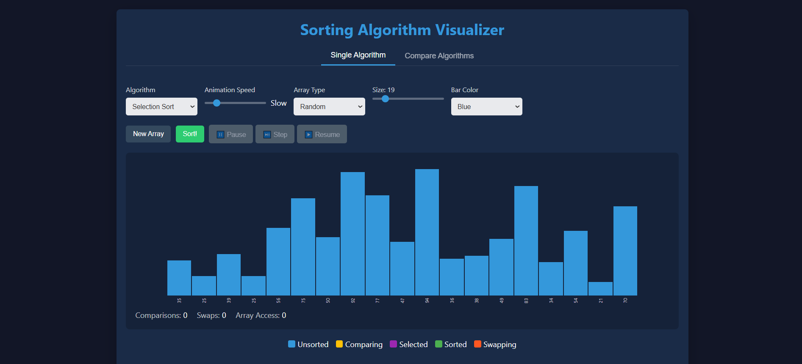
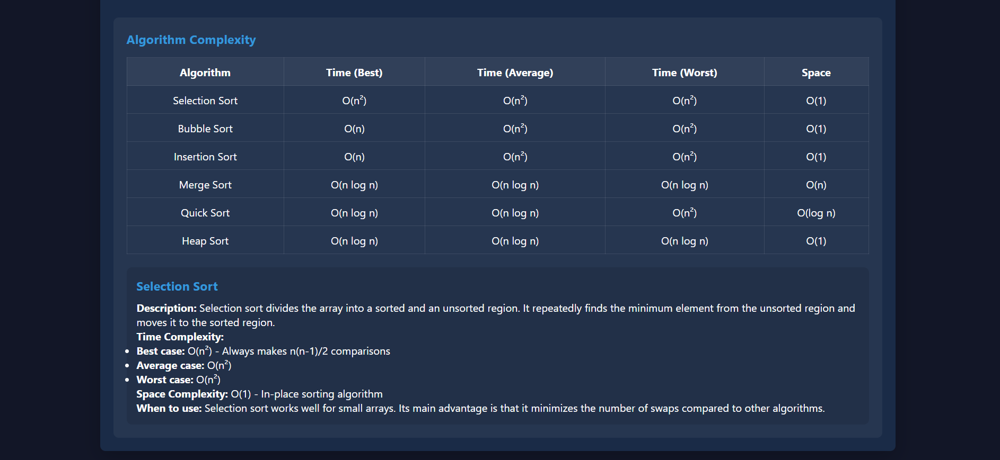
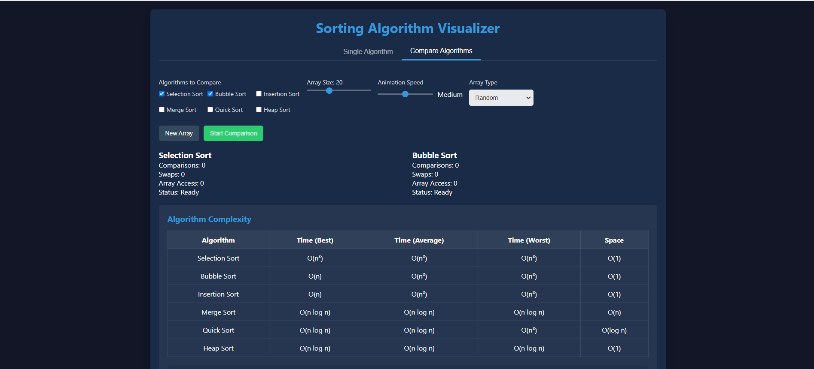

# Sorting Visualizer

Welcome to the Sorting Visualizer! 🚀 This interactive web application allows you to visualize how various sorting algorithms work in real-time. Customize arrays, tweak animation speeds, and observe how sorting operations take place step-by-step.

#### 🌐 Live Demo: https://sorting-visualizer-blue-kappa.vercel.app/

# 🎯 Features

✅ Algorithms Supported:

Selection Sort

Bubble Sort

Insertion Sort

Merge Sort

Quick Sort

Heap Sort

✅ Animation Speed Control:
Choose from Very Slow, Slow, Medium, or Fast.

✅ Array Customization:

Generate a Random Array

Enter a Custom Array

✅ Visualization Customization:

Adjust Array Size

Choose Bar Color (e.g., Blue, Red, Green)

✅ Real-Time Metrics:
Displays:

Number of Comparisons

Number of Swaps

Number of Array Accesses

✅ Algorithm Complexity Table:
Get insight into time & space complexity for each algorithm.
## 📸 Preview

## 📂 Project Structure

#### 📁 Sorting Visualizer

├── 📄 index.html   # Main structure of the webpage

├── 🎨 styles.css   # Styling for UI components

├── 📜 script.js    # Logic for sorting and visualization

## 🚀 Getting Started

 1️⃣ Clone the Repository

git clone https://github.com/your-username/sorting-visualizer.git
cd sorting-visualizer

 2️⃣ Open in Browser

Simply open index.html in any modern web browser.

 3️⃣ Customize & Play 🎨

Select a sorting algorithm.

Adjust speed and size.

Choose a color and start sorting!

## 🖥️ Technologies Used

HTML – For structuring the web page

CSS – For styling and layout

JavaScript – For sorting logic and animations

# 📌 Future Improvements

🔹 Rebuild using React.js for better scalability

🔹 Add step-by-step algorithm walkthroughs

🔹 Implement an algorithm comparison mode

🔹 Support for dual sorting visual display

# 🏆 Contributing

Feel free to fork, contribute, or report issues. Your contributions are always welcome! 😊

# 🚀 Happy Sorting! 🎉
