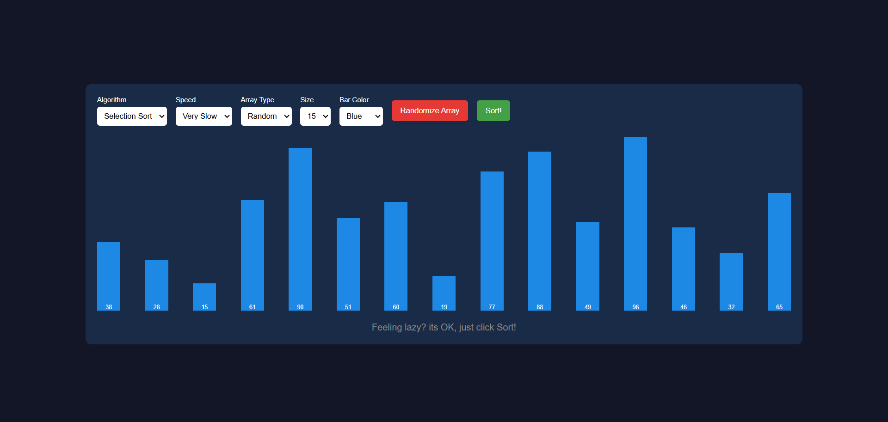

# Sorting Visualizer

Welcome to the Sorting Visualizer! 🚀 This interactive web application lets you visualize sorting algorithms in action. Customize the array, select different sorting methods, adjust speed, and observe how the sorting takes place in real-time.

# 🎯 Features

✅ Choose Your Sorting Algorithm: Selection Sort, Bubble Sort, and Insertion Sort.

✅ Adjust Sorting Speed: Choose from Very Slow, Slow, Medium, or Fast.

✅ Custom or Random Array: Input your own numbers or generate a random array.

✅ Size and Color Customization: Modify array size and bar colors for better visualization.

✅ Performance Insights: View the number of operations taken by each algorithm.

## 📸 Preview

# 📂 Project Structure

📁 Sorting Visualizer

├── 📄 index.html   # Main structure of the webpage

├── 🎨 styles.css   # Styling for UI components

├── 📜 script.js    # Logic for sorting and visualization

# 🚀 Getting Started

 1️⃣ Clone the Repository

git clone https://github.com/your-username/sorting-visualizer.git
cd sorting-visualizer

 2️⃣ Open in Browser

Simply open index.html in any modern web browser.

 3️⃣ Customize & Play 🎨

Select a sorting algorithm.

Adjust speed and size.

Choose a color and start sorting!

# 🖥️ Technologies Used

HTML – For structuring the web page

CSS – For styling and layout

JavaScript – For sorting logic and animations

# 📌 Future Improvements

🔹 Add Merge Sort, Quick Sort, and Heap Sort.

🔹 Implement React.js for enhanced visualization.

🔹 Include step-by-step explanations for each sorting step.

# 🏆 Contributing

Feel free to fork, contribute, or report issues. Your contributions are always welcome! 😊

# 🚀 Happy Sorting! 🎉
